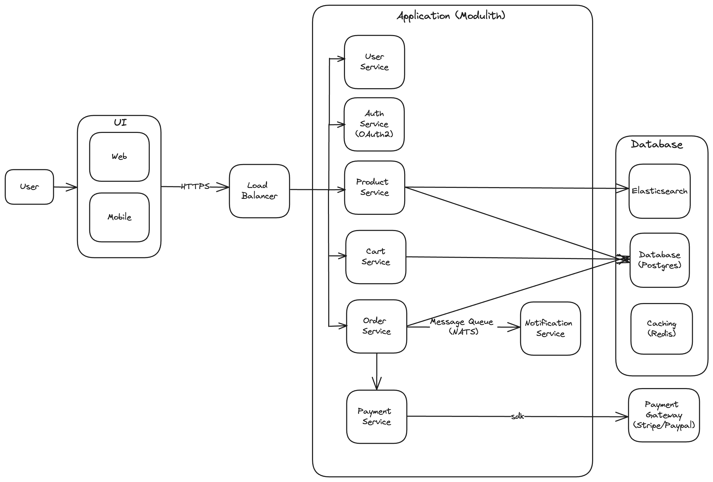

# VBuy
VBuy is a simple ecommerce platform where customers can search products, add them to their carts and buy them

## Architecture Diagram

## APIs
### Products

| HTTP Method | Endpoint | Comments | Scope |
| --- | --- | --- | --- |
| GET | /products | list of products | ALL |
| GET | /products/{id} | get product by id | ALL |
| POST | /products | create product | SELLER |
| DELETE | /products/{id} | delete product by id | SELLER |
| PATCH | /products/{id} | update product by id | SELLER |

### Cart

| HTTP Method | Endpoint | Comments | Scope |
| --- | --- | --- | --- |
| GET | /cart | list of items in cart | ALL (USER with credentials, GUEST with session cookie) |
| POST | /cart | add items to cart | ALL (USER with credentials, GUEST with session cookie) |
| DELETE | /cart/{id} | delete item in cart | ALL (USER with credentials, GUEST with session cookie) |
| PATCH | /cart/{id} | update item by id | ALL (USER with credentials, GUEST with session cookie) |

### Orders

| HTTP Method | Endpoint | Comments | Scope |
| --- | --- | --- | --- |
| GET | /orders | list of all orders | USER |
| GET | /orders/{id} | get order by id | USER |
| POST | /orders | create order | USER |
| DELETE | /orders/{id} | delete order by id | USER |
| PATCH | /orders/{id} | update order by id | USER |

### Payment

| HTTP Method | Endpoint | Comments | Scope |
| --- | --- | --- | --- |
| POST | /payment | process a payment | USER |

### Notifications

| HTTP Method | Endpoint | Comments | Scope |
| --- | --- | --- | --- |
| POST | /notifications | create notifications | USER |
| GET | /notifications | list of all notifications | USER |
| GET | /notifications/{id} | get notification by id | USER |
| DELETE | /notifications/{id} | delete notification | USER |
| PATCH | /notifications/{id} | update notification by id | USER |

### Users

| HTTP Method | Endpoint | Comments | Scope |
| --- | --- | --- | --- |
| POST | /users | create a user | ALL |
| GET | /users/{id} | get user by id | USER |
| DELETE | /users/{id} | delete user by id | USER |
| PATCH | /users/{id} | update user by id | USER |
